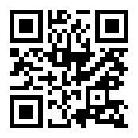

# 项目介绍
- 本项目主要通过深度学习算法基于过去的的交易数据学习如果对涨跌进行分类,为交易做决策,该决策一般用于尾盘
- 模型基于我自研的ModestCattle(有点不要face,明明是搭积木哈哈),它基于Transfomer(优点:注意力机制)和Time2Vec(优点:通过cos,sin汲取深层时间特征)
- 目前市面也有很多诸如LSTM,GRU等语言模型处理金融投资决策的问题,但我认为大多数出发点不对,他们都是把股票预测当作回归问题来处理,如明天涨到多少钱,这谁说的准,说不定明天主力心情好,干个2000万进去,所以我们要让它当作分类问题来处理,分类问题的上层是概率,明天涨跌的概率,我认为如此合理一些
- IDEA:做过股票的朋友都知道,股票的涨跌取决于过去一段时间的趋势,今天的分时,大盘的过去和今天的走势,新闻,散户的情绪等等,所以在这里我们把它们揉在一块,模型分为编码器和解码器 当前个股和大盘的K线,分时我们采用Transfomer 进行价值编码,对新闻,政策,散户评论采用Bert进行情绪编码,然后cat后解码,目前情绪编码还没弄,爬虫还有点问题,过两天我开源下东财和同花顺的爬虫,看看哪位大佬基于反反爬给我提提建议
- 效果:准确率最高0.8
- 模型和想法还有诸多值得改进之处,请诸君多批评哈哈
# 使用步骤
## 原始版本 仅支持日k学习 
- 1.运行get_code.py,获取当前市场存在的股票代码
- 2.运行get_data.py,通过股票代码获取训练样本数据
- 3.运行train_with_?.py运行不同的训练模型训练(?里没有sql)
- 4.运行evel_with_?.py获取当前市场所有标的近xx天预测未来涨跌(?里没有sql)
## SQL版本 可以多编码学习 日K,分时,大盘, 新闻,散户评论(更新中)
- 1.mysql数据库导入 ai_stock.sql 下载地址:https://www.wenshushu.cn/box/8c4kvxdniul
- 2.运行get_data_to_sql.py,get_trick_to_sql.py 下载日k和分时数据 注意修改代码里的 host, port, user=, password, db
- 3.运行train_with_Transfomer_from_sql.py 进行训练
- 4.运行evel_with_transformer_sql.py 查看效果
# 学习交流

# 开源协议
本项目遵循 Heartfelt Goodness 开源协议,本协议的遵守全靠自愿自觉,您克隆本项目可以进行任意的商业,个人研究或学习,但希望您可以发自内心的做一件善事,给残疾人福利基金会捐款,帮身边的朋友一个忙,给你的亲人打一个电话,给你爱或爱你的人一个拥抱等等,只有您是发自内心的.下面是残疾人福利基金会地址,不是我的咖啡码哈,我开源它的目的是希望尽我的微薄能力帮助哪些处于困惑的灵魂,希望这份真诚能够被您传递!

